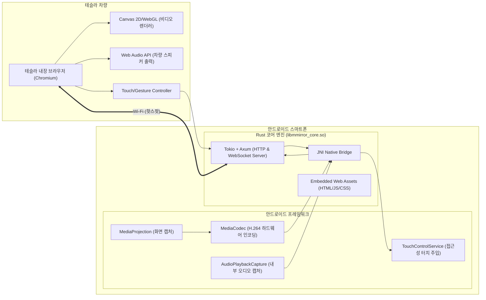

# mplat Mirror for Tesla 🚗📱

[](https://github.com)
[](LICENSE)
[](https://developer.android.com)
[](core-rust)

**테슬라 차량 내비게이션 브라우저(Tesla In-Car Browser)**를 통해 안드로이드 스마트폰의 화면을 초저지연으로 미러링하고, 테슬라 터치스크린으로 폰을 양방향 조작하며 차량 스피커로 오디오를 출력하는 고성능 미러링 솔루션입니다.

---

## 🌟 주요 특징

1. **테슬라 브라우저 최적화 뷰어**:
   - **주행 중 비디오 유지**: HTML5 `<video>`의 자동 일시정지 제약을 회피하기 위해 `<canvas>` 2D/WebGL 하드웨어 가속 렌더링 및 Web Audio API를 적용하여 차량 주행(Drive) 중에도 화면과 소리가 끊기지 않고 유지됩니다.
   - **WebCodecs 초저지연 디코딩**: 스마트폰의 H.264 하드웨어 인코더와 테슬라 Chromium의 하드웨어 디코더를 직결하여 30~50ms 수준의 지연시간을 구현했습니다.
2. **구글 지도 기반 주행일지(Driving Log) & 실시간 HUD 대시보드 (테슬라 API 불필요!)**:
   - **100% 무료 & 테슬라 API 불필요**: 복잡하고 유료인 테슬라 Fleet API 대신 스마트폰의 고정밀 GPS 센서(1초 주기)를 사용하여 주행거리, 소요시간, 속도, 이동 궤적을 100% 무료로 자동 기록합니다.
   - **실시간 HUD 대시보드**: 테슬라 브라우저 상단에 실시간 속도계(Speedometer: km/h), 트립 주행거리(km), 주행시간을 표시합니다.
   - **구글 지도 경로 시각화**: 테슬라 툴바의 **[Trip Log]** 버튼을 누르면 구글 지도 위에 실시간 차량 위치와 지난 주행 기록 목록, 이동 궤적(Polyline)을 한눈에 확인할 수 있습니다.
3. **화면 분할(Split Screen) & 멀티태스킹**:
   - 테슬라 툴바의 **[Split]** 버튼 클릭 한 번으로 안드로이드 화면 분할 모드가 활성화되어 **좌측에는 내비게이션(티맵/카카오내비), 우측에는 유튜브/음악 앱**을 동시에 띄우고 조작할 수 있습니다.
   - **[Rotate]** 버튼으로 가로 1920x1080 와이드 모드로 전환하여 테슬라 디스플레이를 가득 채웁니다.
4. **스마트폰 전원 버튼 오프 시에도 가상 화면(Virtual Display)으로 무중단 동작**:
   - 스마트폰의 **물리 전원 버튼(Power Button)**을 눌러 화면을 완전히 끈 상태에서도, 독립 가상 디스플레이 및 `PARTIAL_WAKE_LOCK`을 통해 테슬라 브라우저에 화면이 계속 출력되고 소리가 나오며 터치 조작이 유지됩니다. (배터리 절약 및 발열 방지)
5. **양방향 터치 & 제스처 제어**:
   - 테슬라 터치스크린의 탭, 드래그, 스와이프 제스처를 스마트폰 안드로이드 접근성 서비스(`AccessibilityService - dispatchGesture`)를 통해 폰에 직접 주입합니다.
   - 화면 잠금 상태에서도 터치 입력 시 키가드를 자동 우회하여 편리하게 제어 가능합니다.
   - 테슬라 화면에 플로팅 가상 내비게이션 바(뒤로가기, 홈, 최근 앱, 화면 분할, 화면 회전, 주행일지, 전체화면)를 제공합니다.
4. **차량 스피커 오디오 스트리밍**:
   - 안드로이드 10+의 `AudioPlaybackCapture`를 통해 스마트폰 내부 사운드(유튜브, 티맵, 음악 등)를 48kHz PCM 스트림으로 캡처하여 테슬라 스피커로 재생합니다.
5. **Rust 초고속 비동기 코어 엔진**:
   - 스마트폰 내부의 HTTP 정적 자원 서빙, WebSocket 스트리밍 브로드캐스트, 바이너리 패킷 파싱 파이프라인을 **Rust (`tokio` + `axum`)**로 구현하여 최소한의 배터리 소모와 극대화된 네트워크 처리량을 보장합니다.

---

## 🏗 시스템 아키텍처



---

## 📁 프로젝트 구조

```
mMirror/
├── core-rust/              # Rust 코어 엔진 (NDK JNI 라이브러리 및 PC 시뮬레이션 바이너리)
│   ├── Cargo.toml          # Rust 의존성 및 cdylib/bin 설정
│   └── src/
│       ├── lib.rs          # JNI 바인딩 및 안드로이드 콜백 인터페이스
│       ├── server.rs       # Axum 기반 비동기 HTTP 및 WebSocket 스트리밍 서버
│       ├── protocol.rs     # 바이너리 패킷 및 터치/키보드 제어 프로토콜
│       ├── web_assets.rs   # 테슬라 웹 뷰어 컴파일 타임 임베딩
│       └── main.rs         # PC 로컬 시뮬레이션 및 테스트 서버
├── web/                    # 테슬라 브라우저 최적화 프론트엔드
│   ├── index.html          # 다크 테마 반응형 뷰어 UI
│   ├── style.css           # 터치 친화적 UI 스타일
│   ├── player.js           # WebCodecs 비디오 디코더 & Web Audio 플레이어
│   └── touch.js            # 테슬라 터치스크린 이벤트 & 가상 내비게이션 바 제어
├── android/                # 안드로이드 애플리케이션 (Kotlin + NDK)
│   ├── app/
│   │   ├── build.gradle.kts
│   │   └── src/main/
│   │       ├── AndroidManifest.xml
│   │       ├── java/io/mmirror/
│   │       │   ├── MainActivity.kt           # 메인 UI 및 권한 요청
│   │       │   ├── MediaProjectionService.kt # 화면/오디오 캡처 포그라운드 서비스
│   │       │   ├── AudioCaptureService.kt    # 내부 오디오 캡처 서비스
│   │       │   ├── TouchControlService.kt    # 양방향 원격 터치 제스처 주입 서비스
│   │       │   └── NativeBridge.kt           # Rust JNI 인터페이스
│   │       └── res/
│   │           ├── layout/activity_main.xml
│   │           └── xml/accessibility_service_config.xml
├── start_dev_server.sh     # PC 로컬 시뮬레이션 서버 실행 스크립트
├── build_android.sh        # 안드로이드 NDK 및 APK 빌드 스크립트
└── README.md
```

---

## 🚀 사용 방법

### 1단계: 스마트폰 핫스팟 켜기
1. 스마트폰 설정에서 **모바일 핫스팟(테더링)**을 켭니다.
2. 테슬라 차량의 Wi-Fi 설정에서 스마트폰의 모바일 핫스팟을 찾아 연결합니다.

### 2단계: mplat Mirror 스마트폰 앱 실행
1. 스마트폰에서 **mplat Mirror 앱**을 실행합니다.
2. [접근성 권한 설정 열기] 버튼을 눌러 **mplat Mirror** 접근성 서비스를 활성화합니다. (테슬라 화면 터치 시 스마트폰이 조작되도록 하는 권한)
3. **[미러링 시작]** 버튼을 누르고 화면 캡처 권한을 허용합니다.

### 3단계: 테슬라 브라우저에서 접속
1. 테슬라 내비게이션 화면의 내장 웹 브라우저를 엽니다.
2. 스마트폰 앱에 표시된 주소를 입력합니다:
   ```
   http://192.168.43.1:8080
   ```
3. 브라우저에 스마트폰 화면이 실시간으로 나타나며, 테슬라 터치스크린을 터치하거나 화면 하단의 가상 홈/뒤로가기 버튼을 눌러 스마트폰을 조작할 수 있습니다.
4. 스마트폰에서 유튜브나 음악을 재생하면 테슬라 차량 스피커로 오디오가 출력됩니다.

---

## 💻 개발 및 로컬 테스트

스마트폰이나 테슬라 차량이 없어도 PC 브라우저에서 개발 및 UI/터치 동작을 즉시 검증할 수 있습니다:

```bash
# 1. PC 개발용 시뮬레이션 서버 실행
./start_dev_server.sh
```

- 웹 브라우저에서 `http://localhost:8080` 접속
- 마우스 클릭, 드래그 및 하단 가상 내비게이션 바(Back, Home, Apps) 클릭 시 터미널에 실시간 수신 이벤트 로그 출력 확인

### 안드로이드 APK 빌드
```bash
# cargo-ndk를 이용한 Android arm64 NDK 및 APK 빌드
./build_android.sh
```

---

## 🏷️ 버전 관리 (Version)

- **현재 버전**: `v1.0.0` (Build 1)
- **주요 릴리즈 이력**:
  - `v1.0.0`:
    - 정식 브랜딩 적용 (`mplat Mirror`) 및 사이버네틱 네온 로고 적용
    - 테슬라 브라우저 / 안드로이드 4단계 이지 온보딩 가이드 제공
    - GPS 기반 실시간 속도계 및 구글 지도 주행일지(Trip Log) 내장
    - 화면 끄기 가상 화면(Virtual Display) 무중단 미러링 지원
    - WebCodecs 초저지연 하드웨어 렌더링 및 양방향 가상 내비게이션 바 지원

---

## 📄 라이선스 (License)

본 프로젝트는 **[Apache License 2.0](LICENSE)** 하에 배포됩니다.

```
Copyright 2026 mplat

Licensed under the Apache License, Version 2.0 (the "License");
you may not use this file except in compliance with the License.
You may obtain a copy of the License at

    http://www.apache.org/licenses/LICENSE-2.0

Unless required by applicable law or agreed to in writing, software
distributed under the License is distributed on an "AS IS" BASIS,
WITHOUT WARRANTIES OR CONDITIONS OF ANY KIND, either express or implied.
See the License for the specific language governing permissions and
limitations under the License.
```

### 3rd-Party 오픈소스 고지
- **Rust Tokio & Axum**: MIT License
- **Leaflet.js**: BSD 2-Clause License
- **AndroidX & Jetpack**: Apache License 2.0
- **Kotlin Coroutines**: Apache License 2.0
- **Google Material Components**: Apache License 2.0

