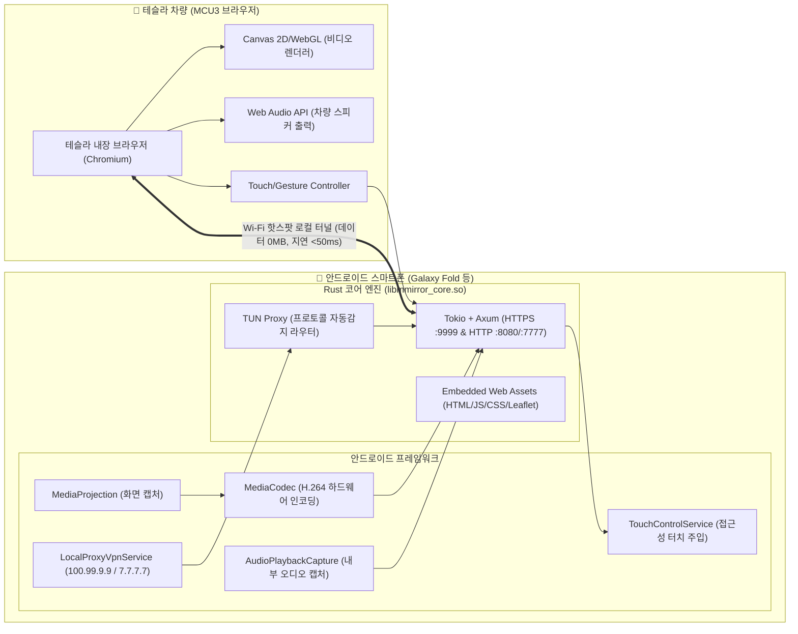

# mplat Mirror for Tesla 🚗📱

[](https://github.com/Profavor/mplatMirror)
[](LICENSE)
[](https://github.com/Profavor/mplatMirror)
[](https://developer.android.com)
[](core-rust)

**테슬라 차량 내비게이션 브라우저(Tesla In-Car Chromium Browser)**를 통해 안드로이드 스마트폰의 화면을 **모바일 데이터 0MB 소모 및 50ms 미만 초저지연**으로 미러링하고, 테슬라 터치스크린으로 폰을 양방향 조작하며 차량 스피커로 고음질 오디오를 출력하는 고성능 로컬 미러링 솔루션입니다.

---

## 🌟 주요 특징

1. **⚡ 데이터 소모 0MB 로컬 가상 프록시 (Local Virtual Proxy)**:
   - 외부 릴레이 서버를 거치지 않고 차량 Wi-Fi 핫스팟 로컬 망 내부에서만 동작하여 통신사 셀룰러 데이터(LTE/5G) 소모가 **0.00MB**입니다.
   - 삼성 핫스팟의 패킷 드롭(`tetherctrl_INPUT`)을 우회하기 위해 `VpnService` 기반 가상 IP(`100.99.9.9`, `7.7.7.7`) 터널을 구성하고, 테슬라 브라우저 PNA 정책을 통과하는 **`https://teslamirror.net:9999`**를 지원합니다.
2. **🚀 WebCodecs + HTML5 Canvas 초저지연 렌더링 (주행 D모드 차단 우회)**:
   - 테슬라는 주행(D) 상태에서 HTML5 `<video>`를 강제 일시 정지시킵니다. mplat Mirror는 **WebCodecs API (`VideoDecoder`)**와 `<canvas>` 하드웨어 가속 렌더러를 탑재하여 주행 중에도 영상과 소리가 절대 꺼지지 않습니다.
3. **✂️ 티맵 분할 크롭 2배 확대 & 보험사 안전점수 100% 적립**:
   - 스마트폰 화면 분할 상태에서 상단 티맵 영역만 정밀 크롭하여 테슬라 화면에 2배로 채우는 **[✂️ 내비 확대]** 모드를 제공합니다.
   - 스마트폰 포그라운드에서 티맵이 정상 구동되므로 **티맵 운전 안전점수 및 보험 할인 혜택이 정상 적립**됩니다.
4. **🚗 로컬 GPS 주행일지(Trip Log) & 오프라인 레이더 HUD**:
   - 테슬라 유료 Fleet API 불필요! 스마트폰 내장 고정밀 GPS로 주행거리, 소요시간, 평균/최고 속도를 로컬에 안전하게 자동 기록합니다.
   - Leaflet JS/CSS를 Rust 코어에 완전 임베딩하여 오프라인 0MB 환경에서도 **텍티컬 다크 레이더 HUD 그리드** 위에 차량 마커(🚘)와 이동 궤적을 실시간 시각화합니다.
5. **📴 스마트폰 물리 전원 버튼 OFF 시에도 가상 화면 무중단 스트리밍**:
   - 폰의 전원 버튼을 눌러 화면을 꺼도, `PARTIAL_WAKE_LOCK`과 독립 가상 디스플레이를 통해 테슬라 브라우저에는 화면이 꺼지지 않고 계속 송출됩니다. (배터리 절약 및 발열 방지)
6. **🦀 Rust 프로토콜 자동감지 라우터 (Protocol Autodetect Router)**:
   - Rust 코어 엔진(`tokio` + `axum`)의 TUN 프록시에서 TLS ClientHello(`0x16`)를 바이트 레벨에서 자동 감지하여 HTTPS(:9999)와 HTTP(:8080/7777)로 자동 분기 처리합니다.

---

## 🏗 시스템 아키텍처



---

## 🚀 빠른 시작 가이드 (Quick Start)

### 1단계: 스마트폰 핫스팟 및 앱 실행
1. 스마트폰 상단바에서 **[모바일 핫스팟]**을 켭니다.
2. `mplat Mirror` 앱을 실행합니다.
3. 앱 상단의 **[⚡ 로컬 가상 프록시 (Tesla Proxy)]** 스위치를 켭니다. (최초 1회 안드로이드 VPN 연결 허용 [확인] 터치)
4. 하단의 **[미러링 시작]**을 누르고 화면 캡처 권한을 허용합니다.

### 2단계: 테슬라 Wi-Fi 연결
1. 테슬라 차량 Wi-Fi 설정에서 스마트폰 핫스팟을 연결합니다.
2. 연결 옵션에서 **[드라이브 중 연결 유지 (Remain connected in Drive)]**를 반드시 체크합니다.

### 3단계: 테슬라 브라우저 접속
1. 테슬라 화면의 내장 웹 브라우저를 엽니다.
2. 주소창에 아래 주소를 입력합니다:
   ```
   https://teslamirror.net:9999
   ```
   *(최초 접속 시 자체 서명 인증서 경고가 뜨면 **[고급 (Advanced)] ➔ [계속 진행(안전하지 않음) / Proceed]**을 1회 터치합니다)*
   - 보조 로컬 가상 주소: `http://td9.cc:7777` 또는 `http://7.7.7.7:7777`
3. 즉시 50ms 미만 초저지연 미러링 화면이 재생됩니다!
4. 상단 메뉴의 **[✂️ 내비 확대]**를 누르면 티맵이 테슬라 화면에 2배로 시원하게 확대됩니다.

---

## 🏷️ 버전 관리 (Version)

- **현재 버전**: `v1.2.1` (Release Build)
- **주요 릴리즈 이력**:
  - `v1.2.1`:
    - 100% 로컬 가상 프록시 (`enableRemoteRelay = false`)로 모바일 데이터 0MB 소모 보장
    - `https://teslamirror.net:9999` 도메인 및 Rust 프로토콜 자동감지 라우터 탑재
    - 주행일지 모달 닫기 대형 터치 타깃 및 오프라인 레이더 HUD 그리드 적용
    - Leaflet JS/CSS 단일 바이너리 로컬 임베딩
  - `v1.0.0`:
    - 정식 브랜딩 적용 (`mplat Mirror`)
    - WebCodecs 초저지연 하드웨어 렌더링 및 양방향 터치 인젝션 지원


---

## 📄 라이선스 (License)

본 프로젝트는 **[Apache License 2.0](LICENSE)** 하에 배포됩니다.

```
Copyright 2026 mplat

Licensed under the Apache License, Version 2.0 (the "License");
you may not use this file except in compliance with the License.
You may obtain a copy of the License at

    http://www.apache.org/licenses/LICENSE-2.0

Unless required by applicable law or agreed to in writing, software
distributed under the License is distributed on an "AS IS" BASIS,
WITHOUT WARRANTIES OR CONDITIONS OF ANY KIND, either express or implied.
See the License for the specific language governing permissions and
limitations under the License.
```

### 3rd-Party 오픈소스 고지
- **Rust Tokio & Axum**: MIT License
- **Leaflet.js**: BSD 2-Clause License
- **AndroidX & Jetpack**: Apache License 2.0
- **Kotlin Coroutines**: Apache License 2.0
- **Google Material Components**: Apache License 2.0

